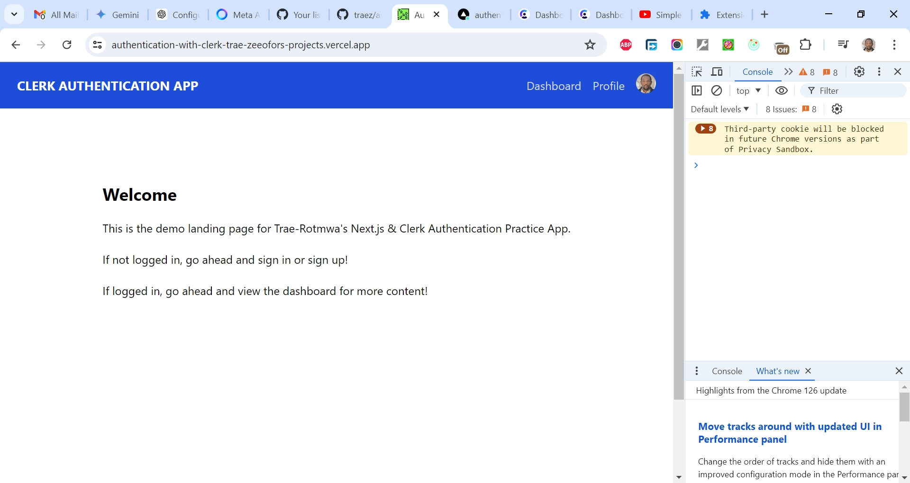

# Authentication in Next.js using Clerk

This is a solution to [Simple Next.js & React Authentication With Clerk Project](https://www.youtube.com/watch?v=RHFmsoiVtKE). I'm practicing and developing my coding competency by building projects after projects.

## Table of contents

- [Overview](#overview)
  - [The challenge](#the-challenge)
  - [Screenshot](#screenshot)
  - [Links](#links)
  - [My process](#my-process)
  - [Built with](#built-with)
  - [What I learned](#what-i-learned)
  - [Continued development](#continued-development)
  - [Useful resources](#useful-resources)
  - [Author](#author)
  - [Acknowledgments](#acknowledgments)

## Overview

### The Challenge/User Stories

In this project, we will buid an authentication system for Next.js using clerk. It can also be used with React SPAs and Remix.

### Screenshot

### Links

- Solution URL: [https://github.com/traez/authentication-with-clerk](https://github.com/traez/authentication-with-clerk)
- Live Site URL: [https://authentication-with-clerk-trae-zeeofors-projects.vercel.app/](https://authentication-with-clerk-trae-zeeofors-projects.vercel.app/)

## My process

### Built with

- Semantic HTML5 markup
- CSS custom properties
- Flexbox and CSS Grid
- Mobile-first workflow
- [React](https://reactjs.org/) - JS library
- [Next.js](https://nextjs.org/) - React framework
- Tailwind CSS
- Typescript**
- Nodejs (with/without Expressjs)
- MongoDB**  
- GraphQL**    
- Redux Toolkit**  
- Clerk   

### What I learned
  
- **Referencing Documentation:** It's crucial to reference documentation alongside tutorials to stay updated on recent developments (not covered in the tutorial) and adjust code accordingly. In this project, I encountered several deprecated processes that required documentation lookup for correction, particularly in the middleware and `@clerk` import statements.  
- **Clerk Bug:** There seems to be a bug in Clerk. When a user exists and attempts to sign up again using GitHub/Google, the return URL redirects endlessly after signup. However Email address signup functions correctly, as Clerk detects existing users.
- **Next.js Parsing Error:** If you encounter a "Cannot find module 'next/base'" error in your Next.js project, locate the .eslintrc.json file. Replace the existing code: `{ "extends": "next/core-web-vitals" }` with `{ "extends": ["next/babel","next/core-web-vitals"] }`  
- **Package Installation in Development:** You can install new packages using a separate terminal window while your Next.js application runs in another.  
- **Environment Variables:** Modern hosting platforms typically offer environment variable management through their dashboards. Use either of `.env` or `.env*.local` , there's no significant difference. But remember to add whichever to your `.gitignore` file.  
- **Customizing Tailwind CSS Container:** In the tailwind.config.js file (where you modify fonts, breakpoints, and colors), you can configure the default behavior of the Tailwind CSS container class under the theme section. This code: `container: { center: true, },` ensures any element with the container class will have its content centered horizontally. This is a common approach for creating centered layouts.  
- **Next.js Middleware:** Middleware allows code execution before request completion. Based on the incoming request, you can modify the response through rewriting, redirecting, header adjustments, or direct response. Define middleware in a file named `middleware.ts` (or `.js`) located at the project root.  
- **Middleware and jsconfig.json:** Because you added `middleware.js` to the `src` folder, you might need to edit `jsconfig.json`. Modify the `paths` configuration to explicitly include the `src` directory by adding: `"/*": ["./src"]`. This approach adds an additional path mapping for `/*` that points to `./src`. Now, the compiler considers files directly in `src` when resolving imports and references. `"app/*": ["./src/app/*"]` might also be necessary.  
- **Optional Catch-all Segments in Dynamic Routes:** Dynamic routes can have optional catch-all segments by including the parameter in double square brackets: `[[...folderName]]`. For example, `app/shop/[[...slug]]/page.js` will match both `/shop` and `/shop/clothes/tops/t-shirts`. This differs from regular catch-all segments, where the route without the parameter wouldn't be matched.  
- **Dynamic Routes for Authentication:** When enforcing authentication/protected routes, it's crucial to make them dynamic routes with optional catch-all segments.  
- **Next.js Authentication Keys:** `NEXT_PUBLIC_CLERK_PUBLISHABLE_KEY` and `CLERK_SECRET_KEY` are used for authentication under the hood. You might not interact with them directly, but other built-in code structures might fail if they're missing. Ensure they're present and transfer them to your hosting dashboard during deployment.  
- **State Management with useState, Props, and Redux Toolkit:** Combining `useState` and props for local state management with Redux Toolkit for global state management provides a balance between simplicity, modularity, power, and scalability. This approach helps maintain and scale your application efficiently.  
- **@clerk/themes:** The `@clerk/themes` package allows customization of the visual styling and branding of Clerk's authentication and user management components. It offers pre-built themes and options for creating custom themes to match your application's design.   

### Continued development

- More projects; increased competence!

### Useful resources

Stackoverflow  
YouTube  
Google  
ChatGPT

## Author

- Website - [Trae Zeeofor](https://github.com/traez)
- Twitter - [@trae_z](https://twitter.com/trae_z)

## Acknowledgments

-Jehovah that keeps breath in my lungs
